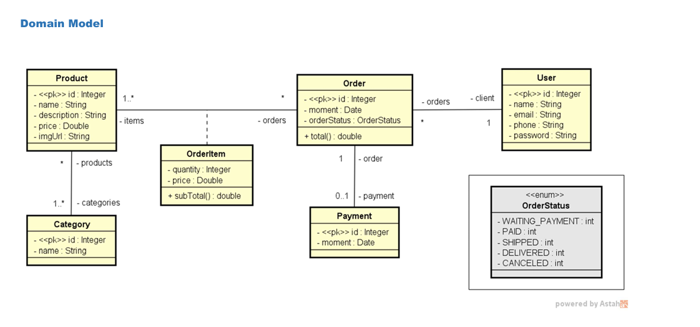
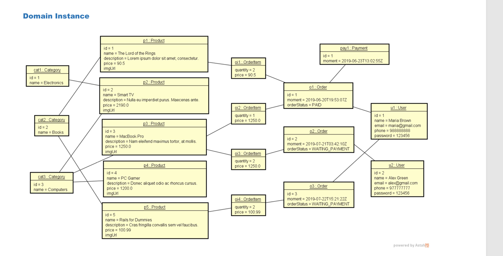

# 🛍️ API de E-commerce
Uma API RESTful para uma plataforma de e-commerce desenvolvida com Spring Boot. Esta API gerencia produtos, pedidos, usuários e pagamentos.

# 🎓 Sobre o Projeto
Este projeto foi desenvolvido como parte do curso "Java COMPLETO - Programação Orientada a Objetos + Projetos" do professor Nélio Alves.

O objetivo é praticar a construção de uma API RESTful real utilizando Java, Spring Boot e outras tecnologias modernas.

# 💻 Tecnologias
Principais

☕ Java 17

🌱 Spring Boot 3.5.0

📊 Spring Data JPA 3.5.0

# Banco de Dados
🗄️ H2 Database

# Ferramentas
🔧 Maven 3.9.0

📝 Spring Doc OpenAPI UI 2.1.0

# 🗂️ Modelo de Domínio

# 🗂️ Instância de Domínio

# 🛣️ Endpoints da API
👥 Usuários
| Método | Endpoint      | Descrição               | Códigos de Status |
| ------ | ------------- | ----------------------- | ----------------- |
| GET    | `/users`      | Lista todos os usuários | 200, 500          |
| GET    | `/users/{id}` | Busca usuário por ID    | 200, 404, 500     |
| POST   | `/users`      | Cria um novo usuário    | 201, 400, 500     |
| PUT    | `/users/{id}` | Atualiza um usuário     | 200, 404, 500     |
| DELETE | `/users/{id}` | Remove um usuário       | 204, 404, 500     |

# Exemplo de requisição para criar um usuário:
curl -X POST http://localhost:8080/users \
-H "Content-Type: application/json" \
-d '{"name": "John Doe", "email": "john@example.com", "phone": "1234567890"}'

# 📑 Categorias
| Método | Endpoint           | Descrição                 | Códigos de Status |
| ------ | ------------------ | ------------------------- | ----------------- |
| GET    | `/categories`      | Lista todas as categorias | 200, 500          |
| GET    | `/categories/{id}` | Busca categoria por ID    | 200, 404, 500     |

### 🗄️ Configuração do Banco de Dados
### Banco de Dados de Desenvolvimento (H2)
Acesse o console do H2 em: http://localhost:8080/h2-console

# application.properties
### Configuração do Banco de Dados
spring.datasource.url=jdbc:h2:mem:testdb
spring.datasource.username=sa
spring.datasource.password=

### Console H2
spring.h2.console.enabled=true
spring.h2.console.path=/h2-console

### Configuração JPA
spring.jpa.show-sql=true
spring.jpa.hibernate.ddl-auto=create-drop
spring.jpa.defer-datasource-initialization=true

# ⭐ Funcionalidades
👥 Gerenciamento de usuários

📑 Categorias de produtos

🛒 Processamento de pedidos

⚠️ Tratamento global de exceções

✅ Validação de dados

🔒 Implementação de segurança

📝 Documentação com OpenAPI (Swagger)

# 🚀 Primeiros Passos
Pré-requisitos

☕ Java 17 ou superior

🔧 Maven

📝 IDE de sua preferência (Recomendado: IntelliJ IDEA)

# 🔨 Instalação
### 1- Clone o repositório:
git clone https://github.com/seu-usuario/ecommerce-api.git

### 2 - Acesse o diretório do projeto:
cd ecommerce-api

### 3 - Compile o projeto:
mvn clean install

### 4 - Execute a aplicação:
mvn spring-boot:run

A API estará disponível em: http://localhost:8080

# 👨‍💻 Estrutura do Projeto
src/
├── main/
│   ├── java/
│   │   └── com/matheus/ecommerce_api/
│   │       ├── config/
│   │       ├── controllers/
│   │       ├── entities/
│   │       ├── repositories/
│   │       ├── services/
│   │       └── ECommerceApiApplication.java
│   └── resources/
│       └── application.properties
└── test/
└── java/
└── com/matheus/ecommerce_api/
└── ECommerceApiApplicationTests.java

# Arquitetura
🎮 Controllers: Responsáveis pelas requisições e respostas HTTP

⚙️ Services: Camada de lógica de negócios

💾 Repositories: Acesso a dados e persistência

📦 Entities: Modelos de domínio

⚡ DTOs: Objetos de Transferência de Dados

# ⚠️ Tratamento de Erros
A API possui um manipulador global de exceções para:

🔍 Recurso não encontrado

🔒 Exceções de banco de dados

❌ Erros de validação

🔄 Conflitos de modificação concorrente

# 🔧 Configurações Adicionais

### Configurações do Servidor
server.error.include-message=always
server.error.include-stacktrace=never
spring.mvc.pathmatch.matching-strategy=ant_path_matcher

### Configurações adicionais do JPA
spring.jpa.open-in-view=true
spring.jpa.properties.hibernate.format_sql=true

# 🧪 Testes
mvn test

# 📈 Melhorias Futuras
🔐 Implementação de autenticação JWT

📊 Melhorias na documentação Swagger

🔄 Implementação de cache

🐳 Integração com Docker

📊 Monitoramento e métricas

# 📚 Aviso Educacional
Este projeto foi desenvolvido com fins educacionais como parte do curso "Java COMPLETO - Programação Orientada a Objetos + Projetos" do professor Nélio Alves.
Não se trata de um produto oficial ou comercial relacionado ao curso ou ao autor.

# 👤 Autor
Matheus Holanda Passos

# 📞 Suporte
Caso tenha dúvidas ou sugestões:

📧 Abra uma issue

🌟 Dê uma estrela no projeto

🔨 Envie um pull request

# 📊 Status do Projeto
Em desenvolvimento ativo

# ⭐ Se este projeto te ajudou, considere dar uma estrela!

 

